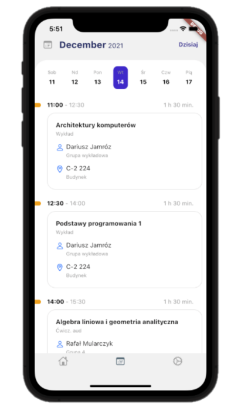

## Hello World!

Hello World!
This is my github page!

Check out my [personal website!](https://fgieracki.com)


  ```                                                                                                                                                                                                                        
                                                                                                                                                                                                                          
    ffffffffffffffff                     iiii                                                                             kkkkkkkk             iiii                                                                       
   f::::::::::::::::f                   i::::i                                                                            k::::::k            i::::i                                                                      
  f::::::::::::::::::f                   iiii                                                                             k::::::k             iiii                                                                       
  f::::::fffffff:::::f                                                                                                    k::::::k                                                                                        
  f:::::f       ffffffggggggggg   gggggiiiiiii     eeeeeeeeeeee    rrrrr   rrrrrrrrr   aaaaaaaaaaaaa      cccccccccccccccc k:::::k    kkkkkkkiiiiiii             cccccccccccccccc   ooooooooooo      mmmmmmm    mmmmmmm   
  f:::::f            g:::::::::ggg::::gi:::::i   ee::::::::::::ee  r::::rrr:::::::::r  a::::::::::::a   cc:::::::::::::::c k:::::k   k:::::k i:::::i           cc:::::::::::::::c oo:::::::::::oo  mm:::::::m  m:::::::mm 
 f:::::::ffffff     g:::::::::::::::::g i::::i  e::::::eeeee:::::eer:::::::::::::::::r aaaaaaaaa:::::a c:::::::::::::::::c k:::::k  k:::::k   i::::i          c:::::::::::::::::co:::::::::::::::om::::::::::mm::::::::::m
 f::::::::::::f    g::::::ggggg::::::gg i::::i e::::::e     e:::::err::::::rrrrr::::::r         a::::ac:::::::cccccc:::::c k:::::k k:::::k    i::::i         c:::::::cccccc:::::co:::::ooooo:::::om::::::::::::::::::::::m
 f::::::::::::f    g:::::g     g:::::g  i::::i e:::::::eeeee::::::e r:::::r     r:::::r  aaaaaaa:::::ac::::::c     ccccccc k::::::k:::::k     i::::i         c::::::c     ccccccco::::o     o::::om:::::mmm::::::mmm:::::m
 f:::::::ffffff    g:::::g     g:::::g  i::::i e:::::::::::::::::e  r:::::r     rrrrrrraa::::::::::::ac:::::c              k:::::::::::k      i::::i         c:::::c             o::::o     o::::om::::m   m::::m   m::::m
  f:::::f          g:::::g     g:::::g  i::::i e::::::eeeeeeeeeee   r:::::r           a::::aaaa::::::ac:::::c              k:::::::::::k      i::::i         c:::::c             o::::o     o::::om::::m   m::::m   m::::m
  f:::::f          g::::::g    g:::::g  i::::i e:::::::e            r:::::r          a::::a    a:::::ac::::::c     ccccccc k::::::k:::::k     i::::i         c::::::c     ccccccco::::o     o::::om::::m   m::::m   m::::m
 f:::::::f         g:::::::ggggg:::::g i::::::ie::::::::e           r:::::r          a::::a    a:::::ac:::::::cccccc:::::ck::::::k k:::::k   i::::::i        c:::::::cccccc:::::co:::::ooooo:::::om::::m   m::::m   m::::m
 f:::::::f          g::::::::::::::::g i::::::i e::::::::eeeeeeee   r:::::r          a:::::aaaa::::::a c:::::::::::::::::ck::::::k  k:::::k  i::::::i ......  c:::::::::::::::::co:::::::::::::::om::::m   m::::m   m::::m
 f:::::::f           gg::::::::::::::g i::::::i  ee:::::::::::::e   r:::::r           a::::::::::aa:::a cc:::::::::::::::ck::::::k   k:::::k i::::::i .::::.   cc:::::::::::::::c oo:::::::::::oo m::::m   m::::m   m::::m
 fffffffff             gggggggg::::::g iiiiiiii    eeeeeeeeeeeeee   rrrrrrr            aaaaaaaaaa  aaaa   cccccccccccccccckkkkkkkk    kkkkkkkiiiiiiii ......     cccccccccccccccc   ooooooooooo   mmmmmm   mmmmmm   mmmmmm
                               g:::::g                                                                                                                                                                                    
                   gggggg      g:::::g                                                                                                                                                                                    
                   g:::::gg   gg:::::g                                                                                                                                                                                    
                    g::::::ggg:::::::g                                                                                                                                                                                    
                     gg:::::::::::::g                                                                                                                                                                                     
                       ggg::::::ggg                                                                                                                                                                                       
                          gggggg                                                                                                                                                                                          

```
# Projekt "Kiedy laby"

## Na czym polega nasz projekt ?

Celem naszego projektu jest stworzenie aplikacji mobilnej służącej do wyświetlania planu zajęć dla studentów wydziału Elektrotechniki Automatyki Informatyki i Inżynierii Biomedycznej AGH. Aplikacja będzie dostępna na urządzeniach z systemem Android i iOS.

Nasza aplikacja pozwoli wyświetlać plan zajęć w wygodny i przejrzysty sposób. Jej głównymi zaletami względem tradycyjnego planu zajęć na stronie wydziału są:
* Szybki i łatwy dostęp do planu zajęć z poziomu telefonu
* Podział na grupy dziekańskie i laboratoryjne (na stronie wydziału ta funkcja działała niepoprawnie)
* Interfejs dopasowany do ekranu telefonu, zapewniający lepszą czytelność na urządzeniach mobilnych
* Ciągły rozwój aplikacji



## Twórcy
- [Mateusz Woźniak](https://matisiekpl.github.io/)
- [Filip Gieracki](https://fgieracki.github.io/)
- [Tomasz Kawiak](https://hevagog.github.io/)
- [Przemysław Maresz](https://przemyslawmaresz.github.io/)


<!-- ### Markdown

Markdown is a lightweight and easy-to-use syntax for styling your writing. It includes conventions for

```markdown
Syntax highlighted code block

# Header 1
## Header 2
### Header 3

- Bulleted
- List

1. Numbered
2. List

**Bold** and _Italic_ and `Code` text

[Link](url) and 
```

For more details see [Basic writing and formatting syntax](https://docs.github.com/en/github/writing-on-github/getting-started-with-writing-and-formatting-on-github/basic-writing-and-formatting-syntax).

### Jekyll Themes

Your Pages site will use the layout and styles from the Jekyll theme you have selected in your [repository settings](https://github.com/fgieracki/fgieracki.github.io/settings/pages). The name of this theme is saved in the Jekyll `_config.yml` configuration file.

### Support or Contact

Having trouble with Pages? Check out our [documentation](https://docs.github.com/categories/github-pages-basics/) or [contact support](https://support.github.com/contact) and we’ll help you sort it out.
--> 
